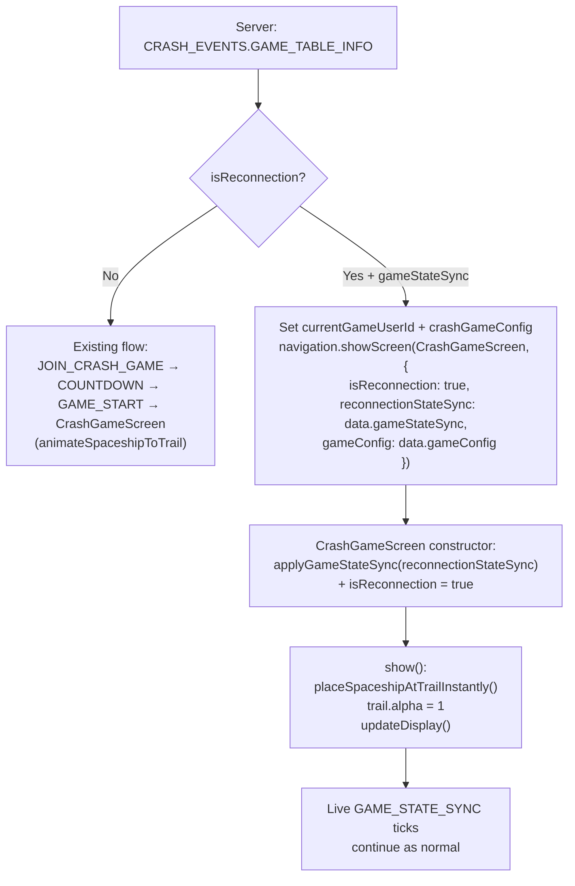

# Crash Game Reconnection

## What changes and why

On reconnection the server sends a `GAME_TABLE_INFO` event with `isReconnection: true` and a `gameStateSync` snapshot of the live game. Right now the handler ignores this flag and the `CrashGameScreen` has no concept of reconnection — it always emits `JOIN_CRASH_GAME`, waits for `GAME_START`, and plays the full parabolic entry animation. The fix teaches three files to handle the fast-path.

---

## 1. `[crash-web/src/types/crashGame.ts](crash-web/src/types/crashGame.ts)` — type updates

`**GameTableInfoPayload**` — add the two new server fields:

```typescript
export interface GameTableInfoPayload {
  matchId: string;
  isReconnection?: boolean;              // new
  gameConfig: CrashGameConfig;
  players: Array<{ gameUserId: string; username: string; status: string }>;
  gameStateSync?: GameStateSyncPayload;  // new — present when isReconnection is true
}
```

`**CrashGameScreenOptions**` — make `GameStartPayload` fields optional so the reconnection path can pass `reconnectionStateSync` instead:

```typescript
export interface CrashGameScreenOptions extends Partial<GameStartPayload> {
  gameConfig?: CrashGameConfig;
  isReconnection?: boolean;
  reconnectionStateSync?: GameStateSyncPayload;
}
```

---

## 2. `[crash-web/src/network/eventListeners.ts](crash-web/src/network/eventListeners.ts)` — reconnection branch

Inside the `CRASH_EVENTS.GAME_TABLE_INFO` handler (currently lines 185–229), add a branch after resolving `currentGameUserId`:

```typescript
if (data.isReconnection && data.gameStateSync) {
  // Game is already running — jump directly to game screen
  await navigation.showScreen(CrashGameScreen, {
    isReconnection: true,
    reconnectionStateSync: data.gameStateSync,
    gameConfig: data.gameConfig,
  });
  return;
}
// existing JOIN_CRASH_GAME emit path below...
```

- No `JOIN_CRASH_GAME` emitted — server already knows the player is in the game.
- No countdown screen, no `GAME_START` wait needed.
- `currentGameUserId` and `crashGameConfig` are still set before this branch (same existing lines).

---

## 3. `[crash-web/src/screens/CrashGameScreen.ts](crash-web/src/screens/CrashGameScreen.ts)` — instant placement

**a. New `isReconnection` field:**

```typescript
private isReconnection = false;
```

**b. Constructor — apply state from `gameStateSync` instead of `applyGameStart`:**

```typescript
constructor(options: CrashGameScreenOptions) {
  ...
  this.isReconnection = options.isReconnection ?? false;

  if (options.isReconnection && options.reconnectionStateSync) {
    this.state.applyGameStateSync(options.reconnectionStateSync);
  } else {
    this.state.applyGameStart(options as GameStartPayload);
  }
  ...
}
```

**c. `show()` — skip parabolic animation on reconnect:**

```typescript
public async show(): Promise<void> {
  this.isReady = true;
  this.spaceshipLottie.setVisible(true);
  this.spaceshipLottie.play();

  if (this.isReconnection) {
    this.placeSpaceshipAtTrailInstantly();  // new method
  } else {
    this.animateSpaceshipToTrail();         // existing
  }

  this.addWebviewListeners();
  this.updateDisplay();
}
```

**d. New `placeSpaceshipAtTrailInstantly()` method** — same coordinate logic as `animateSpaceshipToTrail()` but sets position/rotation directly, shows trail immediately:

```typescript
private placeSpaceshipAtTrailInstantly(): void {
  const canvas = app.renderer.canvas as HTMLCanvasElement;
  const rect = canvas.getBoundingClientRect();
  const { width: pixiWidth, height: pixiHeight } = app.renderer;
  const { WIDTH: lottieW, HEIGHT: lottieH } = CRASH_LOTTIE_LAYOUT;

  const scaleX = rect.width / pixiWidth;
  const scaleY = rect.height / pixiHeight;

  const trailY = (pixiHeight / 1.6) * scaleY + rect.top;
  const endX   = (pixiWidth / 2) * scaleX + rect.left - lottieW / 2 + 35;
  const endY   = trailY - lottieH - 190;

  this.spaceshipLottie.reposition(endX, endY, lottieW, lottieH);

  const lottieContainer = this.spaceshipLottie.getContainerElement();
  if (lottieContainer) {
    lottieContainer.style.rotation = "-30deg";  // final rotation from animateSpaceshipToTrail
  }

  if (!this.destroyed && this.trail) {
    this.trail.alpha = 1;  // no fade-in, show immediately
  }
}
```

---

## Flow diagram




