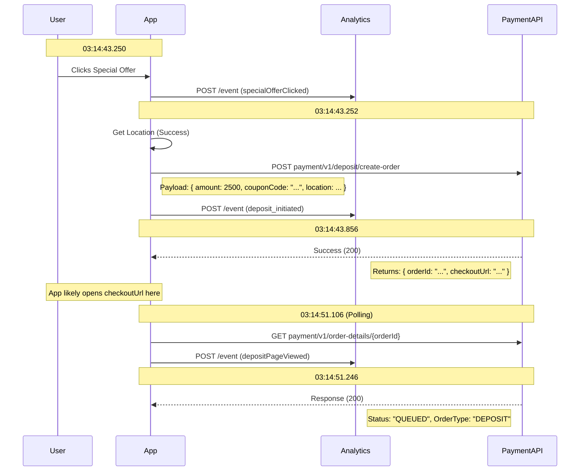

# Deposit Flow Timeline

Based on the provided logs, here is the timeline ("lime line") of the deposit initiation and result polling process.

## Sequence Diagram

## Detailed Timeline

1.  **Deposit Initiation**

    - **Time**: `03:14:43.250` - `03:14:43.255`
    - **Action**: User clicks a special offer.
    - **Process**:
      - The app captures the user's location.
      - The app sends a `create-order` request to the Payment API with the amount (`2500`) and coupon code.
      - An analytics event `deposit_initiated` is logged.

2.  **Order Creation Result**

    - **Time**: `03:14:43.856`
    - **Result**: The Payment API returns success.
    - **Key Data**:
      - `orderId`: `691fd9239eed10af860a5c8b`
      - `checkoutUrl`: `https://wallet.paywithsoap.com...`
    - **Action**: The app presumably redirects the user or opens a webview with the `checkoutUrl` to complete the payment.

3.  **Result Polling (Requesting to Result)**
    - **Time**: `03:14:51.106`
    - **Action**: The app checks the status of the order.
    - **Request**: `GET payment/v1/order-details/691fd9239eed10af860a5c8b`
    - **Result**: The API returns the current status.
    - **Status**: `QUEUED` (The payment is not yet finalized/confirmed in this log snapshot).
